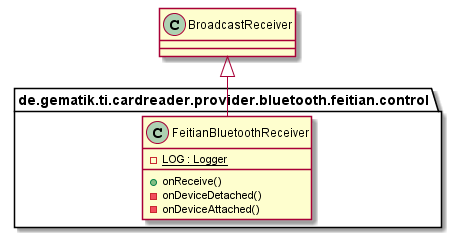
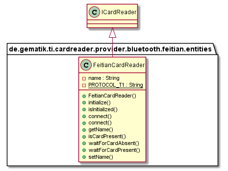

# Bluetooth-Feitian-CardReaderProvider

## Introduction

This part describes the usage of low level CardReaderProvider for feitian bluetooth CardReader in your application.

## API Documentation

Generated API docs are available at <https://gematik.github.io/ref-CardReaderProvider-Bluetooth-Feitian-Android>.

## License

Licensed under the [Apache License, Version 2.0](https://www.apache.org/licenses/LICENSE-2.0).

## Overview

  

### Integration

The Feitian Bluetooth CardReaderProvider needs a descriptor behind `YOUR.PROVIDER\src\main\resources\META-INF\services` with filename
`de.gematik.ti.cardreader.provider.spi.ICardReaderControllerProvider` and the content of the package and class which implements the service provider interface
`de.gematik.ti.cardreader.provider.bluetooth.feithian.control.FeitianCardReaderProvider`.

## Hardware

The integrated Feitian Combo SDK supports the following FEITAN Readers: bR301,iR301,bR301BLE,bR500.

## Control

### FeitianCardReaderProvider

The FeitianCardReaderProvider class needs implementation of the interface 'ICardReaderControllerProvider' to handle listener and provide methods to inform connected listeners about card reader changes.

  

### FeitianCardReaderController

The FeitianCardReaderController class extends the abstract class ’AbstractCardReaderController' to handle necessary permissions and checking if the application context is set.
Returns a list with currently connected Feitian cardReaders and informs about Reader connection and disconnection.

  

### FeitianBluetoothReceiver

The FeitianBluetoothReceiver class extends the BroadCastReceiver class that receives and handles broadcast intents sent by {@link android.content.Context\#sendBroadcast(Intent)}.
The actions of the intents that are being handled are changes in the state of the bluetooth adapter (enable / change) as well as connect and disconnect a bluetooth device.

  

### FeitianConnector

Creates a Socket to the connected Feitian bluetooth device.

  

## Entities

### FeitianCard

A Feithian Bluetooth Smart Card with which a connection has been established.
Card objects are obtained by calling {@link FeitianConnector\#run()} if a socket to the bluetooth device is connected.
Works as adapter to the Feitian Bluetooth SDK.

  

### FeitianCardReader

A Bluetooth Smart Card Reader, sometimes referred to as a Bluetooth Card Reader implements the Interface ICardReader.

  

### FeitianCardChannel

A logical channel connection to a Bluetooth Smart Card.
It is used to exchange APDUs with a Smart Card using Bluetooth/CCID.
A BluetoothCardChannel object can be obtained by calling the method FeitianCard.getBasicChannel or FeitianCard.openLogicalChannel

  

### CardStatusHandler

Each FeitianCardReader needs an Handler for Card Event.
This Handler compute the card reader card events and transmit the suited events to EventBus subscriber.

  

## Getting Started

### Build setup

To use CardReaderProvider for feitian bluetooth CardReader in a project, you need just to include following dependency:

**Gradle dependency settings to use CardReaderProvider for feitian bluetooth CardReader library.**

    dependencies {
        implementation group: 'de.gematik.ti', name: 'cardreader.provider.bluetooth.feitian', version: '1.1.4'
    }

**Maven dependency settings to use CardReaderProvider for feitian bluetooth CardReader library.**

    <dependencies>
        <dependency>
            <groupId>de.gematik.ti</groupId>
            <artifactId>cardreader.provider.bluetooth.feitian</artifactId>
            <version>1.1.4</version>
        </dependency>
    </dependencies>
